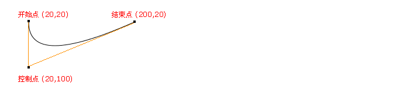

# HTML5-Game

1.绘制海葵
  绘制直线API
  
    * ctx2.save()与ctx2.restore()
    
    * 之间的样式只在这对api之间起作用
    
    * 绘制海葵需要的api
    
    * 1.beginPath()起始一条路径
    
    * 2.moveTo（）把路径移动到画布中的指定点，不创建线条
    
    * 3.lineTo（）添加一个新点，创建该点到最后指定点的线条
    
    * 4.stroke（）绘制已定义的路径
    
    * 5.strokeStyle 设置或返回颜色，渐变或模式
    
    * 6.lineWidth 线条宽度
    
    * 7.lineCap 结束端点样式
    
    * 8.globalAlpha 透明值*/
    
2.绘制果实

    *  drawImage（）；
    *  var fruitObj = function ()
    * {
    *      /* 属性 */
    *  }
    *
    * fruitObj.prototype.init = function ()
    * {
    *    /*初始化果实的属性*/
    * }
    *
    * fruitObj.prototype.draw = function ()
    * {
    *    /*画出果实*/
    * }
    *
    * fruitObj.prototype.born = function ()
    * {
    *    /*随机生成果实的出生点，及随机X,Y坐标*/
    * }
    *
    *  fruitObj.prototype.dead = function ()
    *  {
    *    /*果实被吃点，即改变果实的alive【i】属性*/
    *  }
    *
    *  fruitObj.prototype.fruitMonitor = function ()
    *  {
    *    /*监视画布中的果实数量*/
    *  }
    *
    *   fruitObj.prototype.sendFruit = function ()
    *   {
    *    /*重新生长果实*/
    *   }

3.绘制大鱼

    *   API
    *   translate();
    *   rotate();
    *   Math.atan2(y,x);

4.大鱼与果实的碰撞检测

    *   首先判断大鱼与alive[i] = true果实的距离

    *   var len = calLength2(fruit.x[i], fruit.y[i], mom.x, mom.y);

    *   当距离小鱼小于一定值时

    *   fruitObj.prototype.dead = function (i) {

    *     this.alive[i] = false;

    *   };

    *   data.fruitNum++;

    *    mom.momBodyCount++;

    *   if (mom.momBodyCount > 7) {

    *    mom.momBodyCount = 7;

    *    }

    *    if (fruit.fruitType[i] == 'blue') {

    *    data.double = 2;

    *    }

    *    wave.born(fruit.x[i], fruit.y[i]);

5.绘制小鱼

    *

6.大鱼与小鱼碰撞

    *

7.海葵摆动

    *   quadraticCurveTo(cpx,cpy,x,y);//二次贝塞尔曲线

    *   cpx:控制点X坐标

    *   cpy：控制点Y坐标

    *   x:结束点X坐标

    *   y:结束点y坐标

    *   利用正弦函数值的周期性，将值赋给结束点x坐标，所以每一帧结束点的X坐标都不一样及海葵的状态也不一样。

    *   因为正弦函数具有周期性，所以海葵也会成周期性摆动

8.果实出生点随海葵摆动

    *   当海葵静止不动时，果实的出生点 X坐标即为海葵的X坐标，Y坐标为canvasHeight - 海葵的高度。
    *   当海葵摆动起来时，将每一帧的海葵的X Y坐标当做果实出生的X Y 坐标。